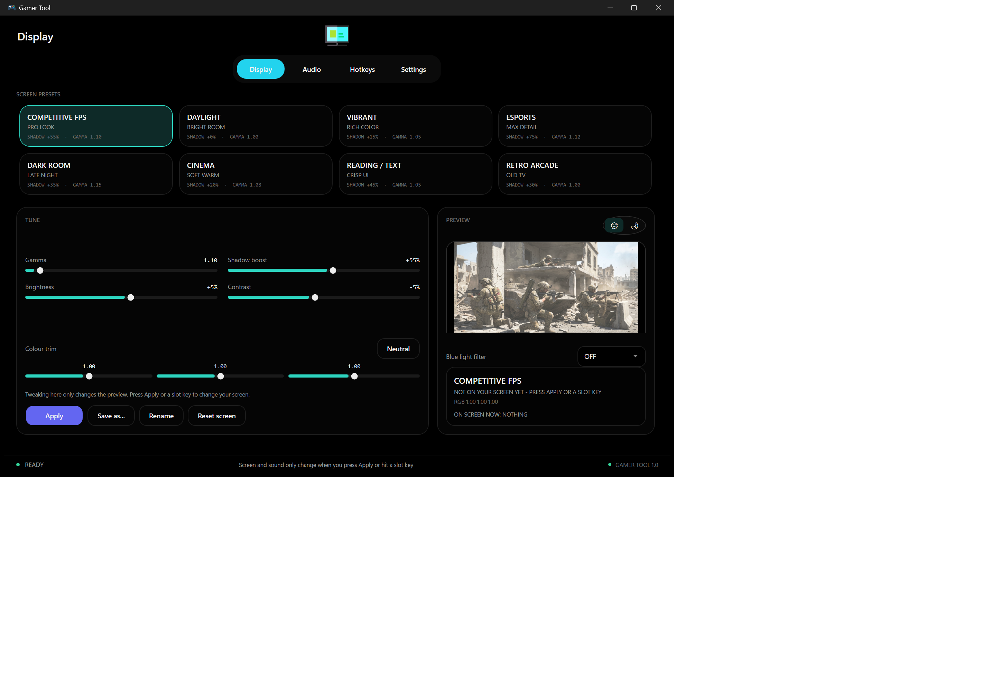
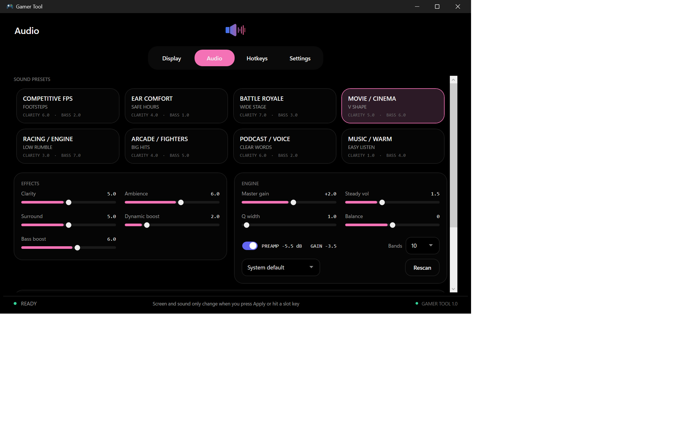
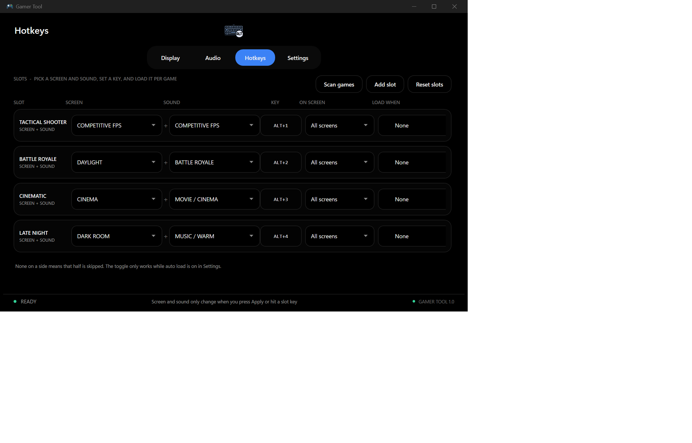
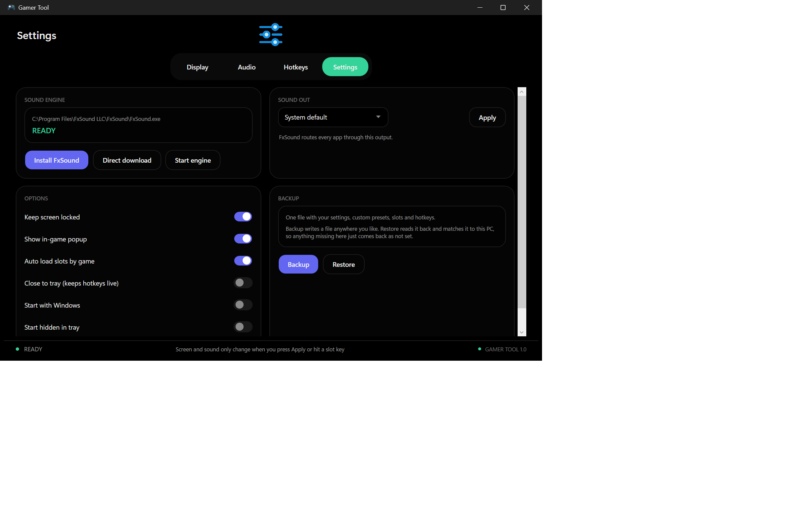

# Gamer Tool

A free Windows 10/11 desktop app for gamers. It tunes your **screen** and your **sound** with one-click presets, then loads them automatically per game using hotkeys. Pick a preset, press Apply or a slot key, done.

Everything is preview-first — nothing changes on your PC until you press **Apply** or hit a slot key.

## 📸 Screenshots

<table>
  <tr>
    <td align="center" width="50%">
      <b>Display Tab</b><br/><br/>
      
    </td>
    <td align="center" width="50%">
      <b>Audio Tab</b><br/><br/>
      
    </td>
  </tr>
  <tr>
    <td align="center" width="50%">
      <b>Hotkeys Tab</b><br/><br/>
      
    </td>
    <td align="center" width="50%">
      <b>Settings Tab</b><br/><br/>
      
    </td>
  </tr>
</table>

---

## What it does

**Display**
- 8 built-in screen presets tuned from real competitive/pro settings (Competitive FPS, Esports, Daylight, Dark Room, Cinema, Reading/Text, Vibrant, Retro Arcade)
- Manual controls: **Gamma, Shadow boost, Brightness, Contrast**, and per-channel **R / G / B colour trim**
- **Blue Light Filter** with Off / Warm / Extra Warm
- Live **day / night preview** of your game scene before you commit to anything
- **Colour trim** and RGB controls work per monitor, so a second screen can stay untouched
- **Save as…** your own presets, or **Rename / Reset** the ones you made

**Audio**
- 8 built-in sound presets: **Competitive FPS, Battle Royale, Tactical, Racing, Arcade/Fighters, Movie/Cinema, Podcast/Voice, Music/Warm** — shaped around where game sounds actually live (footsteps sit mostly in the 1–4 kHz range)
- 5, 10, 15, 20 or 31-band **EQ** with vertical sliders
- Effects: **Clarity, Ambience, Surround, Dynamic boost, Bass boost**
- **Anti-clip (auto preamp)** — pulls master gain back by your biggest EQ boost so nothing distorts
- **Master gain, Steady volume, Q width, Balance**, and an output device picker
- Built-in **preview loop** so you can hear a sound preset before applying it
- **Save as… / Rename** for your own sound presets
- Powered by the free **FxSound** engine (install button included on the Settings tab)

**Hotkeys**
- Build **slots** that combine a screen preset + a sound preset + a key
- Press the key to load that combo instantly — no clicking around
- **Auto load by game**: scan installed games and Steam, then a slot fires on its own when that game launches
- Per-slot target: which monitor, which sound, which key
- Only one slot can auto-load per game, so two slots never fight over the same title
- Duplicate keys are moved to the slot you just set instead of silently conflicting

**Settings**
- One-click **FxSound** install / direct download / start engine
- Toggles: keep screen locked, in-game popup, auto load by game, close to tray, start with Windows, start hidden
- **Backup** and **Restore** — one `.json` file holds your settings, custom presets, slots and hotkeys
- Restore is machine-aware: it matches things to *this* PC, and anything missing simply comes back as "not set" instead of breaking

**Also included**
- OLED-black UI, including the window title bar
- Runs in the tray so hotkeys keep working with the window closed
- Works offline — no accounts, no telemetry, no internet required

---

## Requirements

- Windows 10 or 11
- **[FxSound](https://www.fxsound.com/)** (free) — only needed for the Audio tab. The Display tab works without it.
- .NET 9 SDK (source only — the `.exe` needs nothing)

## Download

Grab the latest `GamerTool.exe` from the [Releases page](../../releases/latest). It is a single self-contained file, so just download and run it.

## Run from source

```powershell
dotnet restore app/GamerTool.csproj
dotnet run --project app/GamerTool.csproj
```

Build it (warnings treated as errors, same as CI):

```powershell
dotnet build app/GamerTool.csproj -c Release -warnaserror
```

## Build the `.exe`

Publishing settings (self-contained, single file, compressed) already live in `GamerTool.csproj`, so this one command is all you need:

```powershell
dotnet publish app/GamerTool.csproj -c Release -o publish
```

The result is `publish\GamerTool.exe` — one file, nothing else required.

---

## 🔄 Automatic releases

Pushing to `main` builds the app and replaces `GamerTool.exe` on a rolling **latest** release automatically, so this download URL never changes:

```
https://github.com/<owner>/<repo>/releases/latest/download/GamerTool.exe
```

The workflow lives in [`.github/workflows/build.yml`](.github/workflows/build.yml). You can also run it by hand from the **Actions** tab.

---

## Project layout

```
app/                   App source (C# / WPF)
  Assets/             Icon, preview images, preview audio, tab art
  Models/             Presets, slots, app settings
  Services/           Display, audio, backup, hotkeys, process watching
  UI/                 Theme and popup styles
.github/workflows/    Automatic build and release
screenshots/          Images used by this README
```

Settings live in `%APPDATA%\GamerTool` — that is the folder to back up or move between PCs.
