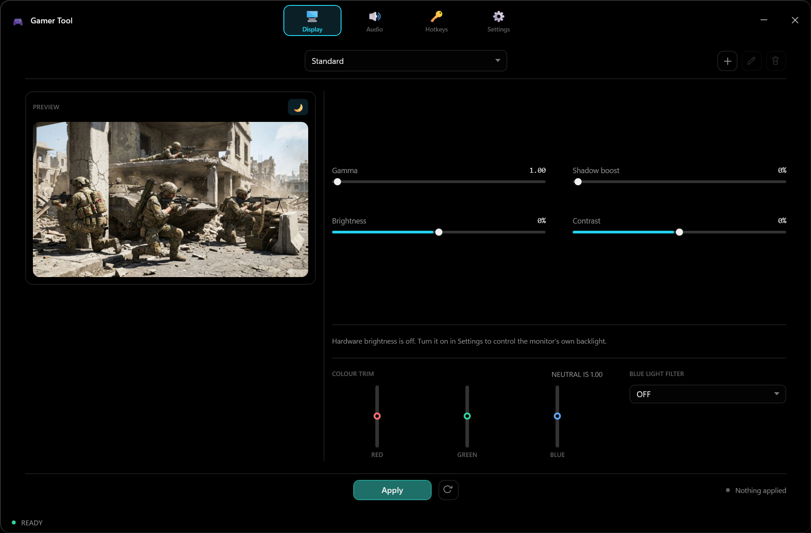
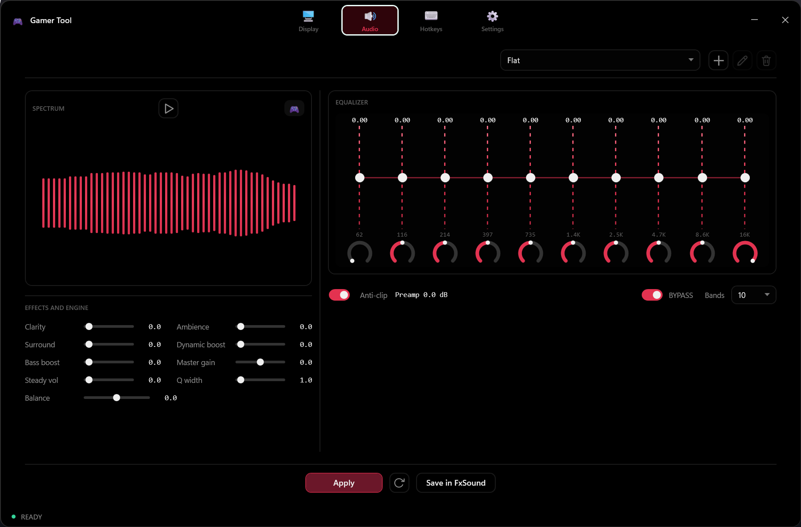
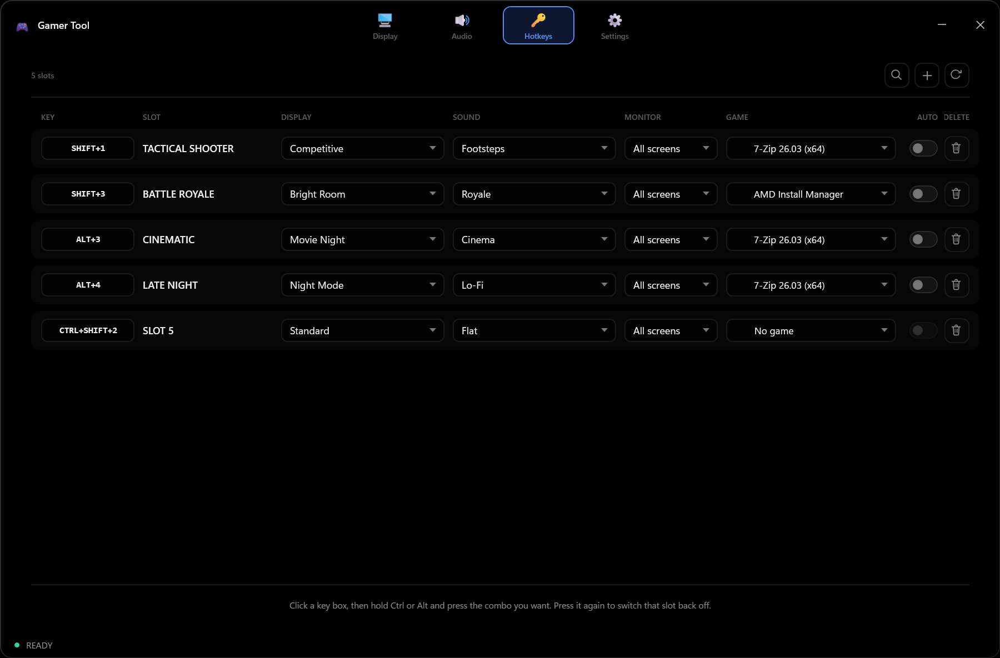
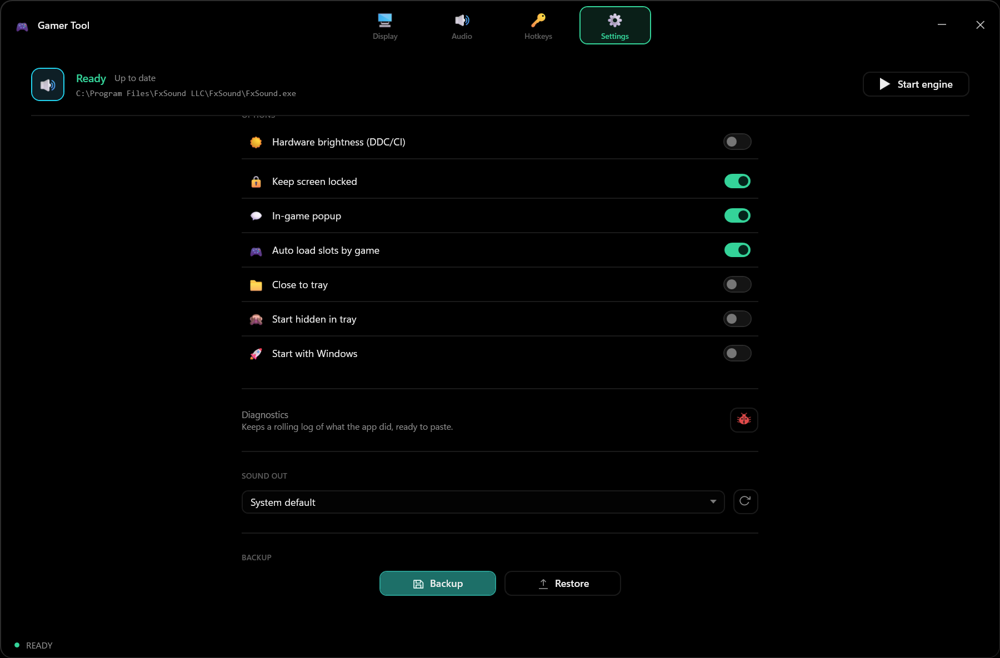

# Gamer Tool

A small Windows app for gamers. Set your screen and sound up once, then switch between them with a single key.

## What it does

**Display** - ready-made screen presets (Competitive, Cinema, Night, Daylight and more) plus manual gamma, brightness, contrast and colour controls. There is also optional control of the monitor's real backlight over DDC/CI, for displays that support it.

**Audio** - sound presets and a 5 to 31 band equaliser, applied through FxSound. An automatic preamp keeps boosting the EQ from ever distorting your audio.

**Hotkeys** - up to six slots. Each slot is a screen preset plus a sound preset plus a key. Press the key and it loads. You can also have a slot load by itself when a game starts.

Nothing is applied until you press **Apply** or a slot key, so you can look first and change second.

## Keyboard and screen readers

Every control can be reached with <kbd>Tab</kbd> and shows a focus ring, the band
frequency dials answer the arrow keys, <kbd>Page Up</kbd>/<kbd>Page Down</kbd> and
<kbd>Home</kbd>/<kbd>End</kbd>, and <kbd>Esc</kbd> backs out of any dialog. The
shortcuts below work whether or not the window has focus.

| Keys | Does |
|---|---|
| <kbd>Shift</kbd>+1,2,3 | Slot shortcuts |
| <kbd>Alt</kbd>+1,2 | Slot shortcuts |
| Any key you assign on the **Hotkeys** tab | Loads that slot, and again to switch it back off |

## Getting started

1. Download `GamerTool.exe` from the [releases page](https://github.com/MyLittlePrimordia/Gamer-Tool/releases/latest) and run it. There is nothing to install.
2. For sound, install [FxSound](https://www.fxsound.com/) (free). There is a button for it on the Settings tab. The Display tab works without it.
3. Open the **Hotkeys** tab and press **+** to add a slot.
4. Pick a screen preset and a sound preset for the slot, then click the key box and press the combination you want, for example `Ctrl+Shift+1`.
5. Press that key in a game. That is the whole app.

## Screenshots

<table>
  <tr>
    <td width="50%"></td>
    <td width="50%"></td>
  </tr>
  <tr>
    <td width="50%"></td>
    <td width="50%"></td>
  </tr>
</table>

## Requirements

- Windows 10 or 11
- FxSound, free, and only if you want the Audio tab

## Building from source

You will need the [.NET 9 SDK](https://dotnet.microsoft.com/download).

```powershell
dotnet publish app/GamerTool.csproj -c Release -o publish
```

That produces `publish\GamerTool.exe`, a single file that runs on its own.

Pushing to `main` builds a release automatically, so the download link above always points at the newest build.

## Notes

- The app lives in the system tray, so hotkeys keep working with the window closed.
- No account, no telemetry, works offline.
- Hardware brightness is off by default. It talks to the monitor over DDC/CI, which a small number of displays with broken firmware have been known to crash Windows on, so it is opt-in and the rest of the app works without it.
- Your settings live in `%APPDATA%\GamerTool`. That is the folder to copy to move everything to another PC.